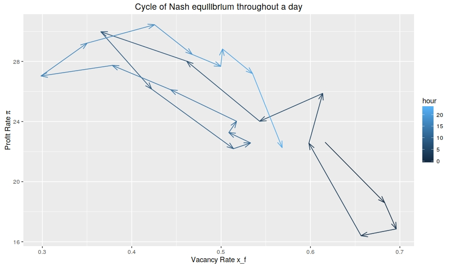
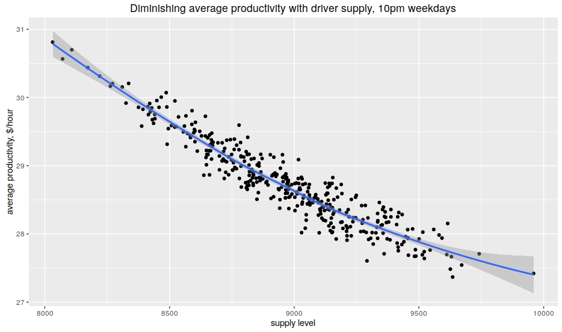
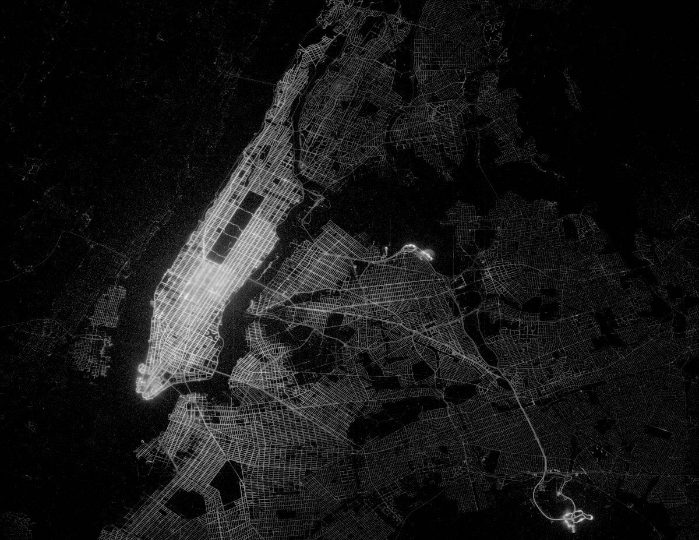
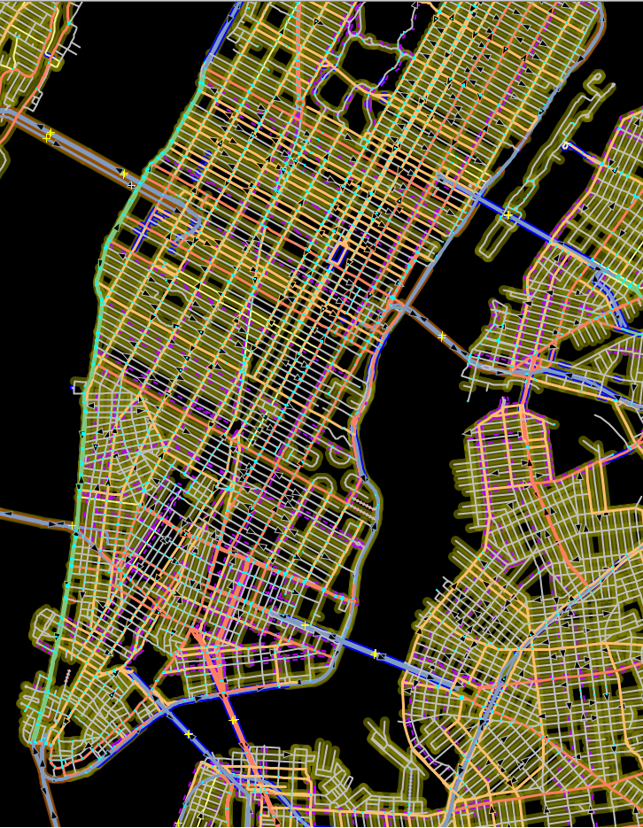

## Dissertation Continuation Plan
&nbsp;
### ZHANG Ruda
### July 2016

--

## Dissertation Outline

Papers planned to submit by year end:

1. An Equilibrium Theory of Taxicab Transportation
1. Contract Structure on Taxicab Driver Profit
1. Upper Bound of Urban Transportation Benefit From Smart Transit Dispatch

--

## Paper 1:
## An Equilibrium Theory of Taxicab Transportation

---

### Trajectory of taxicab transportation equilibria

For each 1-hour time slot with fixed environment conditions, at equilibrium, taxi drivers have equal profit rate `$\mu_\Pi$` and vacancy rate `$x_f$`, despite their free time distribution.

NOTE: a general trend is, when vacancy rate is large, profit rate is lower, although the daily cycle does not follow a simple curve.

---

### Constitutive relation and economic efficiency

Average productivity of supply level.

Fixed factors of production: demand field `$\mu_h(x)$`, trip duration `$m_{t_o}(x)$`, traffic field `$v(x)$`.

NOTE: The law of diminishing marginal productivity implies a diminishing average productivity `$\mu_\Pi$` as total supply `$N$` increases, which is verified in the figure.

---

### Marginal profit rate and economic efficiency

`\[ \frac{\partial \mu_\pi}{\partial \mu_f}(x)  = \frac{\sum_x \Delta \mu_\Pi(x)}{\sum_x \Delta \mu_f(x)} \]`

- If taxicab allocation is efficient, driver's marginal profit rate shall equal their marginal cost, i.e. their alternative income.
- If lower than alternative income, drivers are over-supplied and thus inefficient.

<!-- Marginal profit rate of supply intensity:
`\[\$14.6,\quad 80\%~CI: (\$11.2, \$18.3)\]` -->

NOTE: NYC bus driver have $21/hour income.

---

### Spatial distribution of free taxicab supply and passenger demand

NOTE: To be computed.
Moreover, ANOVA on supply distribution would directly validate my proposed equilibrium. [in-group variation << inter-group variation]

--

## Paper 2:
## Lease Structure on Taxicab Driver Profit

NOTE: with Carrillo?

---

### Research Outline

A labor and econometrics study.

- Subject: independent owner-operator, group, and fleet driver's difference in Medallion use and rent apportioning.
- Hypothesis: compared to fleet agents, independent owner-operators have fewer operation hours, better profit rate, more spread out shift changes.
- Significance: empirical validation of economic theory.

Note: contract structure; TLC Rules available online; price control on fleet agents; rate control on taxi drivers;
Inspired by The Theory of Share Tenancy {Cheung1969}.

--

## Paper 3:
## Upper Bound of Urban Transportation Benefit From Smart Transit Dispatch

NOTE: Internship/Work/Startup Plan

---

### Research Outline

Main thesis: Performance bound and optimizing resource allocation.

- Presumption:
`transportation_benefit(inherent urban characteristics, resource allocation)`
- Resource: current transportation infrastructure and vehicle inventory
- Allocation: smart dispatch
- Objective: normalized (social) benefit of urban transportation

NOTE: Optimizing on resource allocation leads to upper bounds to different cities.
Probably no convention on transportation benefit exists in literature.

---

### Literature Review

- {Spieser2014} Toward a systemic approach to the design and evaluation of automated mobility-on-demand systems: A case study in Singapore.
- {Fagnant2014}, The travel and environmental implications of shared autonomous vehicles, using agent-based model scenarios.
- {Santi2014}, Quantifying the benefits of vehicle pooling with shareability networks

NOTE: With smart dispatch system on board, the only difference between autonomous vehicle and vehicle sharing /transit is one more seat and one less salary.

---

### Research Feasibility

<!--  -->

Model components:

- road network,
- multi-modal transportation profiler,
- traffic demand model, volume-speed models;

Key variables: vehicle size, etc;

Enabling technology (implied in model): mobile connectivity;

NOTE: show screenshot of simplified road network with JOSM;
multi-modal transportation profiler 'r5' (+ 'analyst-server');
Traffic demand model could be built from transportation agency summary reports;
Taxi demand model from NYC taxi study;
